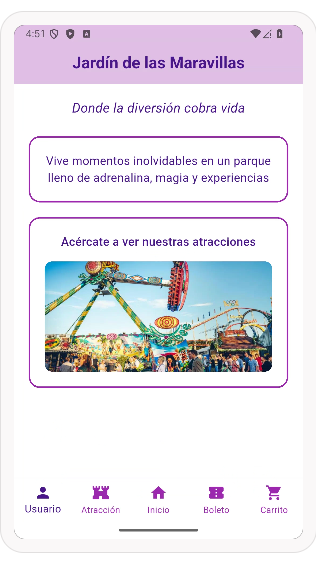

# myapp

# MI PROMPT A LA AI
lenguaje dart flutter, nivel principiante, haremos esta pantalla fondo color blanco en la parte de arriba una barra que diga "jardín de las maravillas con fondo morado claro y el texto morado mas oscuro" debajo escribirás "Donde la diversión cobra vida" y abajo dos filas que parecerán recuadros centrados, con el borde morado, en la primera escribirás "Vive momentos inolvidables en un parque lleno de adrenalina, magia y experiencias" en morado, en la segunda fila escribirás "Acércate a ver nuestras atracciones" igual en morado y en esa misma fila pero debajo del texto una imagen desde la red de una atracción, y al final un appbar con un icono de usuario, una atracción, una casita, un boleto y un carrito, todo debe ser en tonos morados, en un mismo archivo, si te queda alguna duda dímela

## MI DISEÑO

